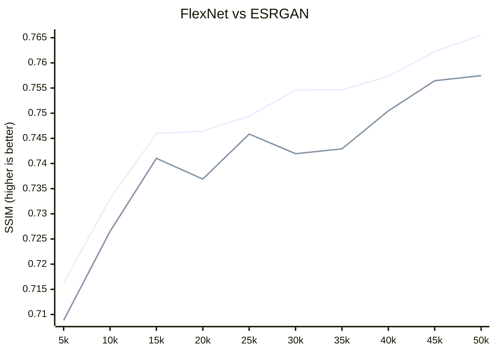

# FlexNet - Flexibility Network.
## Updates:
- Added [FlexNet_V1](https://github.com/umzi2/FlexNet/blob/master/FlexNet_arch.py#L691)
## Project Goal:
I'm not particularly fond of coming up with names for networks, and I don't always stick to just one idea. Technically, if I were to name this network fully based on the concepts (Omni Shift Low-to-high Multi-Level Transformer and Linear Transformer), as you can see, that's quite a mouthful. So, I decided to make it simpler, naming it FlexNet and turning it into not just the name of a single architecture but a collection of various transformer-based networks under one name. Moving forward, I plan to add branches from FlexNet_v1 with suffixes and describe their features here.
## FlexNet_V1:
The primary goal of this network is to create a transformer with medium inference speed, which would be faster and higher quality than ESRGAN while maintaining stability.
### To achieve this goal, I implemented:
- Two types of pipelines: Meta and Linear:
  - Meta: A process of image resizing based on the idea of [MetaFormer](https://github.com/sail-sg/metaformer), allowing the network to better generalize large objects. This could be useful for tasks like restoration and halftone removal. However, this approach significantly increases the number of parameters, resulting in a model size of over 100 megabytes.
  - Linear: A standard pipeline where the image size remains unchanged, and it sequentially passes through ViT blocks. Compared to Meta, this approach requires fewer parameters and is better suited for handling short sequences. I consider it more favorable for standard SR tasks.
- Attention block from [LMLT](https://github.com/jwgdmkj/LMLT/blob/main/LMLT.py#L151): Compared to the Swin block, it has higher speed and lower memory consumption, and performs better on smaller network scales.
- Channel mixing block [ChannelMix](https://github.com/Yaziwel/Restore-RWKV/blob/main/model/Restore_RWKV.py#L222): Used for generalization and enhancing perception.
- [OmniShift](https://github.com/Yaziwel/Restore-RWKV/blob/main/model/Restore_RWKV.py#L81): Another generalization method. Although it significantly slows down training, it improves inference greatly with minimal time overhead due to reparameterization.
### Preliminary Test Results (later, once I finish the preliminary tests, I'll publish the full statistics):

### blue - FlexNet | green - ESRGAN

### References:
[LMLT](https://github.com/jwgdmkj/LMLT/tree/main)

[Restore-RWKV](https://github.com/Yaziwel/Restore-RWKV/tree/main)
```bibtex
@misc{yang2024restorerwkv,
      title={Restore-RWKV: Efficient and Effective Medical Image Restoration with RWKV}, 
      author={Zhiwen Yang and Hui Zhang and Dan Zhao and Bingzheng Wei and Yan Xu},
      year={2024},
      eprint={2407.11087},
      archivePrefix={arXiv},
      primaryClass={eess.IV}
}
```
[metaformer](https://github.com/sail-sg/metaformer)
```bibtex
@article{yu2024metaformer,
  author={Yu, Weihao and Si, Chenyang and Zhou, Pan and Luo, Mi and Zhou, Yichen and Feng, Jiashi and Yan, Shuicheng and Wang, Xinchao},
  journal={IEEE Transactions on Pattern Analysis and Machine Intelligence}, 
  title={MetaFormer Baselines for Vision}, 
  year={2024},
  volume={46},
  number={2},
  pages={896-912},
  doi={10.1109/TPAMI.2023.3329173}}
}
```
