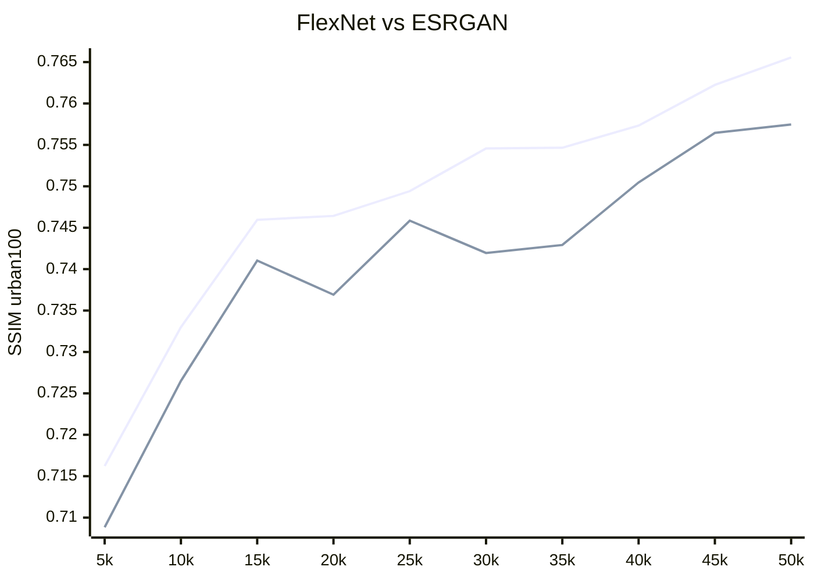

# FlexNet - Flexibility Network.
## Обновления:
- Добавление [FlexNet_V1](https://github.com/umzi2/FlexNet/blob/master/FlexNet_arch.py#L691)
## Цель проекта:
Я не очень люблю придумывать именя сетям, и не всегда ограничиваюсь одной идеи, технически если полноценно называть эту сеть по идеям (Omni Shift Low-to-high Multi-Level Transformer and Linear Transformer), что как вы видети многовато. И я решил сделать всё проще, назвать это всё FlexNet и сделать это не названием одной архитектуры, а сборником раличных трансформерных сетей под одним названием. В дальнейшем я буду добовлять отвлетления от FlexNet_v1 с приписками и описывать их особенности тут.
## FlexNet_V1:
Первостепенной задачей этой сети я поставил создание трансформера со средней скоростью вывода, который был бы быстрее и качественнее ESRGAN, при этом оставаясь стабильным. 
### Для достижения этой цели я реализовал:
- Два типа pipeline: Meta и Linear:
  - Meta: процесс изменения размеров изображения, основанный на идее [MetaFormer](https://github.com/sail-sg/metaformer), который позволяет сети лучше обобщать крупные объекты. Это может быть полезно для задач восстановления и удаления полутонов, однако такой подход сильно увеличивает количество параметров, в результате чего размер модели превышает 100 мегабайт.
  - Linear: стандартный тип pipeline, при котором размер изображения не изменяется, и оно последовательно проходит через блоки ViT. По сравнению с Meta, этот подход требует меньше параметров и лучше справляется с обработкой коротких последовательностей. Я считаю его более предпочтительным для стандартных задач SR.
- Блок внимания из [LMLT](https://github.com/jwgdmkj/LMLT/blob/main/LMLT.py#L151): По сравнению с блоком Swin обладает большей скоростью и меньшим потреблением памяти, а также лучше работает на малых масштабах сети.
- Блок смешивания каналов [ChannelMix](https://github.com/Yaziwel/Restore-RWKV/blob/main/model/Restore_RWKV.py#L222): Используется для обобщения и улучшения восприятия.
- [OmniShift](https://github.com/Yaziwel/Restore-RWKV/blob/main/model/Restore_RWKV.py#L81): Также метод обобщения. Несмотря на то, что он значительно замедляет тренировку, за счёт репараметризации существенно улучшает вывод при минимальных временных затратах.
### Небольшие результаты тестирования (позже, когда сделаю предварительные, я выложу полноценную статистику):
#### blue - FlexNet | green - ESRGAN

### Референсы:
[LMLT](https://github.com/jwgdmkj/LMLT/tree/main)

[Restore-RWKV](https://github.com/Yaziwel/Restore-RWKV/tree/main)
```bibtex
@misc{yang2024restorerwkv,
      title={Restore-RWKV: Efficient and Effective Medical Image Restoration with RWKV}, 
      author={Zhiwen Yang and Hui Zhang and Dan Zhao and Bingzheng Wei and Yan Xu},
      year={2024},
      eprint={2407.11087},
      archivePrefix={arXiv},
      primaryClass={eess.IV}
}
```
[metaformer](https://github.com/sail-sg/metaformer)
```bibtex
@article{yu2024metaformer,
  author={Yu, Weihao and Si, Chenyang and Zhou, Pan and Luo, Mi and Zhou, Yichen and Feng, Jiashi and Yan, Shuicheng and Wang, Xinchao},
  journal={IEEE Transactions on Pattern Analysis and Machine Intelligence}, 
  title={MetaFormer Baselines for Vision}, 
  year={2024},
  volume={46},
  number={2},
  pages={896-912},
  doi={10.1109/TPAMI.2023.3329173}}
}
```
